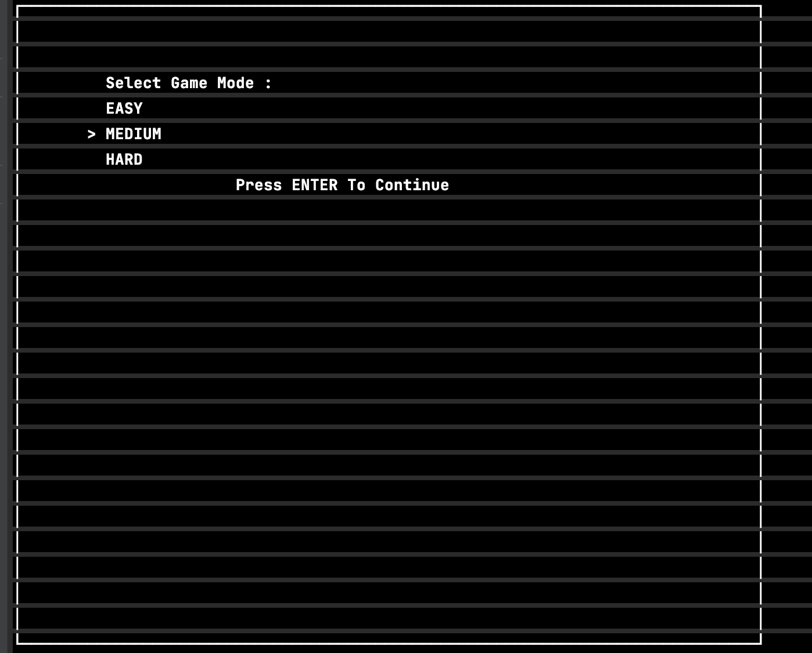

### Snake Game

This is a simple implementation of the classic Snake game in Go using the _github.com/gdamore/tcell_ package for terminal-based graphics.
How to Run

To run the game, make sure you have Go installed on your system. Then, follow these steps:

1. Clone the repository to your local machine.
2. Navigate to the project directory.
3. Run the following command to build and execute the game:
`   go run main.go
`
4. Use arrow keys to control the direction.
### Gameplay

- Use the arrow keys to control the movement of the snake.
- The game starts in the **NOT STARTED** state. Press the arrow keys to select the game mode and start the game.
- The objective is to guide the snake to eat the food and grow in length without colliding with the walls or itself.
- The game ends when the snake collides with the walls or itself, displaying "GAME OVER" on the screen.
Code Structure

The main game logic is implemented in the main.go file, which includes the game initialization, event handling, screen updates, and game over conditions.
Dependencies

- This game relies on the _github.com/gdamore/tcell_ package for terminal-based graphics and user input handling.

---
Game Snippet

